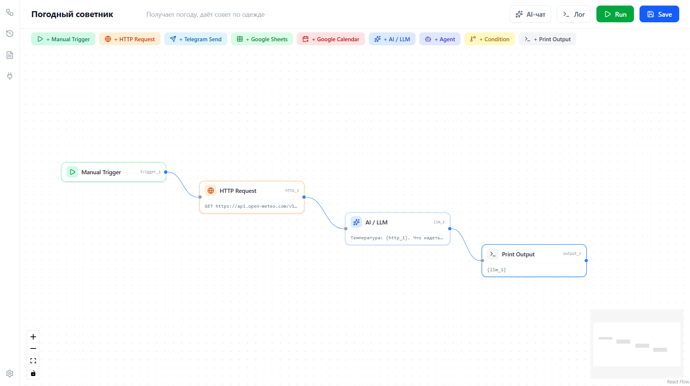

# FlowMind AI

**Визуальный конструктор AI-агентов и автоматизаций**



## О сервисе

FlowMind AI — no-code редактор для сборки AI-агентов и автоматизаций на визуальном графе (canvas), вдохновлённый n8n, но построенный вокруг агента с самого начала, а не поверх обычного automation-движка.

Ключевое отличие: агент реально **рассуждает и сам решает**, какой инструмент вызвать и когда остановиться (полноценный tool calling), а не просто генерирует текст по цепочке шагов. И всё это может работать **полностью локально** — через [Ollama](https://ollama.com), без API-ключа и счетов за токены — либо в облаке, если нужно больше мощностей или запуск на слабом железе.

### Для кого

Малый и средний бизнес (в первую очередь на CIS-рынке), которому нужен AI-ассистент для поддержки клиентов, обработки заказов, планирования встреч и подобных сценариев — но не хочется ни писать код, ни отдавать данные клиентов в чужое облако, ни получать непредсказуемый счёт за токены. При этом сама платформа остаётся достаточно гибкой и для технических пользователей, которым важен self-hosting и контроль над инфраструктурой.

---

## Возможности

- **Agent-loop с tool calling** — агент сам решает, вызывать ли инструмент, с какими параметрами, и когда дать финальный ответ. Работает и локально (Ollama + qwen2.5), и в облаке (через OpenAI-совместимые провайдеры: OpenAI, OpenRouter, Groq).
- **Любая нода может стать инструментом агента** — достаточно заполнить `tool_name`/`tool_description` в конфиге, без хардкода под конкретный тип.
- **Визуальный canvas-редактор** (React Flow) — drag-and-drop ноды, реальные связи графа определяют порядок выполнения (топологическая сортировка, а не порядок в массиве).
- **Готовые интеграции:**
    - HTTP-запросы
    - Telegram — отправка сообщений через Bot API
    - Google Таблицы — добавление строк (через OAuth2)
    - Google Календарь — создание событий (через OAuth2)
- **Подключения (Connections)** — централизованное хранение API-ключей и токенов, с маскировкой секретов при отображении. Разделены на категории: AI API (модели) и Инструменты (сервисы).
- **Читаемый чат-лог выполнения** — вместо сырого JSON, диалог агента с инструментами в человекочитаемом виде.
- **История выполнений, шаблоны готовых сценариев, настройки дефолтов** — отдельные страницы, не только сам редактор.

---

## Технологический стек

**Backend:** FastAPI · SQLAlchemy (async) · SQLite · httpx
**Frontend:** React · TypeScript · Vite · React Flow (`@xyflow/react`) · Tailwind CSS · lucide-react
**LLM:** Ollama (локально, по умолчанию `qwen2.5`) · любой OpenAI-совместимый облачный провайдер · Hugging Face Inference API

---

## Архитектура (кратко)

```
frontend (Vite, порт 5173)
   │  /api/* проксируется →
   ▼
backend (FastAPI, порт 8000)
   │
   ├─ SQLite (workflows, executions, connections)
   │
   ├─ WorkflowEngine (worker.py)
   │    ├─ топологическая сортировка нод по рёбрам графа
   │    ├─ agent-loop (LLM решает, вызывать ли инструмент)
   │    └─ любая нода с tool_name — потенциальный инструмент
   │
   └─ LLMProvider
        ├─ mode=local  → Ollama (/api/chat, /api/generate)
        └─ mode=cloud  → подключение (openai_compatible / huggingface)
```

---

## Быстрый старт

### 1. Локальная LLM (Ollama)

```bash
# https://ollama.com/download
ollama pull qwen2.5
ollama serve
```

### 2. Backend

```bash
cd backend
python3 -m venv venv
source venv/bin/activate      # Windows: venv\Scripts\activate
pip install -r requirements.txt
```

Создай `.env` в папке `backend`:

```env
DATABASE_URL=sqlite+aiosqlite:///./flowmind.db
LLM_MODE=local
OLLAMA_URL=http://localhost:11434
OLLAMA_MODEL=qwen2.5

# Опционально — для Google Sheets/Calendar интеграций (см. ниже)
GOOGLE_CLIENT_ID=
GOOGLE_CLIENT_SECRET=
GOOGLE_REDIRECT_URI=http://localhost:8000/oauth/google/callback
FRONTEND_URL=http://localhost:5173
```

Запуск:

```bash
uvicorn app.main:app --reload --host 0.0.0.0 --port 8000
```

API-документация: [http://localhost:8000/docs](http://localhost:8000/docs)

### 3. Frontend

```bash
cd frontend
npm install
npm run dev
```

Приложение: [http://localhost:5173](http://localhost:5173) — `/api/*`-запросы автоматически проксируются на backend (настроено в `vite.config.ts`).

---

## Настройка подключений

Все внешние сервисы и облачные модели настраиваются на странице **Подключения** — ничего не нужно прописывать в коде вручную.

| Подключение                | Что нужно                  | Где взять                                                                |
| -------------------------- | -------------------------- | ------------------------------------------------------------------------ |
| Hugging Face               | API Key                    | [huggingface.co/settings/tokens](https://huggingface.co/settings/tokens) |
| OpenAI-совместимый         | Base URL + API Key         | OpenAI / OpenRouter / Groq и т.п.                                        |
| Telegram Bot               | Bot Token                  | [@BotFather](https://t.me/BotFather) в Telegram                          |
| Google Таблицы / Календарь | Вход через Google (OAuth2) | требует настройки в Google Cloud Console — см. ниже                      |

### Настройка Google OAuth (для Таблиц и Календаря)

1. [console.cloud.google.com](https://console.cloud.google.com) → создай проект.
2. **APIs & Services → Library** → включи **Google Sheets API** и **Google Calendar API**.
3. **APIs & Services → Google Auth Platform** → пройди мастер настройки (App Information → Audience: **External** → Contact Information) → на вкладке **Audience** добавь свой аккаунт в **Test users**.
4. **APIs & Services → Credentials → Create Credentials → OAuth client ID** → тип **Web application** → в **Authorized redirect URIs** добавь:
    ```
    http://localhost:8000/oauth/google/callback
    ```
5. Скопируй **Client ID** и **Client Secret** в `.env` backend (см. выше).
6. На странице **Подключения** → категория "Инструменты" → "Google Таблицы"/"Google Календарь" → **Войти через Google**.

---

## Как собрать первый workflow

1. Открой **Новый воркфлоу**.
2. Добавь ноду **Manual Trigger** — точка входа.
3. Добавь ноду **Agent** — заполни системный промпт, выбери режим (`local`/`cloud`), при `cloud` укажи подключение.
4. Добавь ноду-инструмент (**HTTP Request**, **Telegram Send**, **Google Sheets**, **Google Calendar**) — заполни `Tool name`/`Tool description`/`Parameters schema`.
5. Соедини **нижний разъём** Agent-ноды (↓ инструменты) с нодой-инструментом — эта связь помечается как `tool`, а не обычный порядок выполнения.
6. **Save** → **Run** → введи тестовый запрос → открой **Лог**, чтобы увидеть, как агент рассуждал и какие инструменты вызвал.

---

## Известные ограничения / что ещё не готово

- **Telegram-триггер (прослушка входящих сообщений)** — пока не реализован. Сейчас `Telegram Send` работает только как исходящий инструмент; входящий поток (long polling или webhook) — в разработке.
- **Память диалога** — каждый запуск агента не помнит предыдущие сообщения в рамках одной беседы.
- **AI-чат для построения графа по текстовому описанию** — в интерфейсе есть заготовка, но подключения к backend пока нет.
- Google-интеграции требуют ручной настройки OAuth-приложения в Google Cloud Console (см. выше) — это ограничение самого Google, не проекта.

---

## Структура проекта

```
FlowMind-AI/
├── backend/
│   ├── app/
│   ├── venv/                  (.gitignore)
│   ├── .env                   (.gitignore)
│   ├── .env.example
│   ├── Dockerfile
│   ├── flowmind.db            (.gitignore)
│   └── requirements.txt
├── docs/
│   └── screenshot.png
├── frontend/
│   ├── node_modules/          (.gitignore)
│   ├── public/
│   │   ├── favicon.svg
│   │   └── icons.svg
│   ├── src/
│   │   ├── api/
│   │   ├── components/
│   │   │   └── canvas/
│   │   │       ├── AiChatPanel.tsx
│   │   │       ├── CanvasNode.tsx
│   │   │       ├── ChatLogPanel.tsx
│   │   │       ├── EditorSidebar.tsx
│   │   │       └── NodeConfigPanel.tsx
│   │   ├── pages/
│   │   │   ├── Connections.tsx
│   │   │   ├── ExecutionHistory.tsx
│   │   │   ├── Settings.tsx
│   │   │   ├── Templates.tsx
│   │   │   ├── WorkflowEditor.tsx
│   │   │   └── WorkflowList.tsx
│   │   ├── types/
│   │   │   └── workflow.ts
│   │   ├── utils/
│   │   │   ├── executionLog.ts
│   │   │   ├── providers.ts
│   │   │   └── settings.ts
│   │   ├── App.tsx
│   │   ├── index.css
│   │   └── main.tsx
│   ├── .gitignore
│   ├── Dockerfile
│   ├── eslint.config.js
│   ├── index.html
│   ├── nginx.conf
│   ├── package-lock.json
│   ├── package.json
│   ├── postcss.config.js
│   ├── tailwind.config.js
│   ├── tsconfig.app.json
│   ├── tsconfig.json
│   ├── tsconfig.node.json
│   └── vite.config.ts
├── .gitignore
├── docker-compose.yml
├── docker-compose.cloud.yml
└── README.md
```
